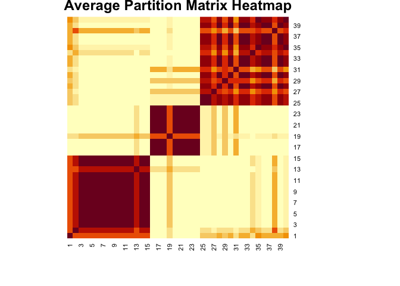

<!-- README.md is generated from README.Rmd. Please edit that file -->

# stocBM

A set of functions to get the partitions of a stochastic blockmodel for
mobility networks; that is, for a cross-classification matrix in which
rowsums differ between rows AND rowsums and columnsums differ. In other
words, a stochastic blockmodel for directed, weighted networks, which is
conditional on the in- and out-degree distribution.

## Installation

You can install the current version of stocBM from GitHub using:

``` r
# install.packages("remotes")
remotes::install_github("perblock/stocBM")
```

## Small example

First, we create a matrix of counts as an example and add some
structure:

``` r
library(stocBM)

test_mat <- matrix(rpois(1600, lambda = 10), nrow = 40, ncol = 40)
test_mat[1:15, 1:15] <- test_mat[1:15, 1:15] + 2  # Add some structure
test_mat[25:40, 16:24] <- test_mat[25:40, 16:24] + 3  # Add some structure

# Look at the first rows and columns
test_mat[1:10, 1:10]
#>       [,1] [,2] [,3] [,4] [,5] [,6] [,7] [,8] [,9] [,10]
#>  [1,]    9   10   11   15   10    8    9   17   13    11
#>  [2,]   12   14   15   12   11   15   17    8    8    12
#>  [3,]   17   15   14    9   10    9   20    6   16    12
#>  [4,]   11   12   10   14    9   14    6    4   10    16
#>  [5,]   13    8   10    8    8   11   14   10   13    13
#>  [6,]   11   12   15   11   11   17   13   14   10     7
#>  [7,]   12   10    9   17   14   11   15    9   13     9
#>  [8,]   11   20   17    5   10   16   12   13   12    12
#>  [9,]   15   11   14    9   14   16   15   12    6    19
#> [10,]   11   10   18    4   15   10   10   14   11    10
```

Now we can run a simple first test to get a (probably) preliminary
partitioning. In case the partitions are very clear, this might already
be pretty good.

``` r
init_res <- repeat_until_no_improvement(test_mat, n_blocks = 3, max_iter = 1000)
#> Iteration: 1 Fit (AIC): 326377.3 
#> Iteration: 2 Fit (AIC): 326370.4 
#> Iteration: 3 Fit (AIC): 326366.6 
#> Iteration: 4 Fit (AIC): 326362.6 
#> Iteration: 5 Fit (AIC): 326358.9 
#> Iteration: 6 Fit (AIC): 326354.4 
#> Iteration: 7 Fit (AIC): 326349.3 
#> Iteration: 8 Fit (AIC): 326346.1 
#> Iteration: 9 Fit (AIC): 326343.1 
#> Iteration: 10 Fit (AIC): 326336.9 
#> Iteration: 11 Fit (AIC): 326335.2 
#> Iteration: 12 Fit (AIC): 326333.7 
#> Iteration: 13 Fit (AIC): 326329.8 
#> Iteration: 14 Fit (AIC): 326326.8 
#> Iteration: 15 Fit (AIC): 326324.8 
#> Iteration: 16 Fit (AIC): 326321.1 
#> Iteration: 17 Fit (AIC): 326319.5
init_res$partition
#>  [1] 1 3 3 3 3 1 1 2 3 1 2 1 3 1 1 2 1 3 1 2 1 3 3 2 1 3 3 1 1 1 2 1 2 2 1 2 2 3
#> [39] 1 3
```

Ok, that looks not ideal, there are some misclassified nodes. Next, we
do a more extensive sampling of different good partitions and a plot of
average same block membership:

``` r
repeat_result <- repeat_sample_likely_partition(test_mat, n_blocks = 3, n_runs = 10, n_iter = 1000)
#> Run: 1 
#> Iteration: 100 Fit (AIC): 326366.7 
#> Iteration: 200 Fit (AIC): 326358.8 
#> Iteration: 300 Fit (AIC): 326342.4 
#> Iteration: 400 Fit (AIC): 326324.6 
#> Iteration: 500 Fit (AIC): 326330.7 
#> Iteration: 600 Fit (AIC): 326333.5 
#> Iteration: 700 Fit (AIC): 326330.8 
#> Iteration: 800 Fit (AIC): 326326.1 
#> Iteration: 900 Fit (AIC): 326309.6 
#> Iteration: 1000 Fit (AIC): 326313 
#> Iteration: 1100 Fit (AIC): 326313.7 
#> Iteration: 1200 Fit (AIC): 326317.3 
#> Iteration: 1300 Fit (AIC): 326304.7 
#> Iteration: 1400 Fit (AIC): 326308.2 
#> Iteration: 1500 Fit (AIC): 326312 
#> Iteration: 1600 Fit (AIC): 326318.1 
#> Iteration: 1700 Fit (AIC): 326297.6 
#> Iteration: 1800 Fit (AIC): 326307.6 
#> Iteration: 1900 Fit (AIC): 326299.4 
#> Iteration: 2000 Fit (AIC): 326307.3 
#> Iteration: 2100 Fit (AIC): 326298.2 
#> Iteration: 2200 Fit (AIC): 326301.5 
#> Iteration: 2300 Fit (AIC): 326289.9 
#> Iteration: 2400 Fit (AIC): 326288.5 
#> Iteration: 2500 Fit (AIC): 326287.6 
#> Iteration: 2600 Fit (AIC): 326265.8 
#> Iteration: 2700 Fit (AIC): 326265.8 
#> Iteration: 2800 Fit (AIC): 326264.8 
#> Iteration: 2900 Fit (AIC): 326262.6 
#> Iteration: 3000 Fit (AIC): 326261.9 
#> Iteration: 3100 Fit (AIC): 326266.7 
#> Iteration: 3200 Fit (AIC): 326261.2 
#> Iteration: 3300 Fit (AIC): 326261.2 
#> Iteration: 3400 Fit (AIC): 326261.2 
#> Iteration: 3500 Fit (AIC): 326257.9 
#> Iteration: 3600 Fit (AIC): 326255.6 
#> Iteration: 3700 Fit (AIC): 326255.6 
#> Iteration: 3800 Fit (AIC): 326256.4 
#> Iteration: 3900 Fit (AIC): 326256.4 
#> Iteration: 4000 Fit (AIC): 326266.5 
#> Iteration: 4100 Fit (AIC): 326256.4 
#> Iteration: 4200 Fit (AIC): 326266.2 
#> Iteration: 4300 Fit (AIC): 326264.1 
#> Iteration: 4400 Fit (AIC): 326256.4 
#> Iteration: 4500 Fit (AIC): 326261.2 
#> Iteration: 4600 Fit (AIC): 326272.2 
#> Iteration: 4700 Fit (AIC): 326262.7 
#> Iteration: 4800 Fit (AIC): 326269.3 
#> Iteration: 4900 Fit (AIC): 326269.9 
#> Iteration: 5000 Fit (AIC): 326261.7 
#> Run: 2 
#> Iteration: 100 Fit (AIC): 326258.6 
#> Iteration: 200 Fit (AIC): 326258.6 
#> Iteration: 300 Fit (AIC): 326268.4 
#> Iteration: 400 Fit (AIC): 326267.4 
#> Iteration: 500 Fit (AIC): 326257.9 
#> Iteration: 600 Fit (AIC): 326258.9 
#> Iteration: 700 Fit (AIC): 326258.6 
#> Iteration: 800 Fit (AIC): 326258.6 
#> Iteration: 900 Fit (AIC): 326258.6 
#> Iteration: 1000 Fit (AIC): 326256.4 
#> Run: 3 
#> Iteration: 100 Fit (AIC): 326255.6 
#> Iteration: 200 Fit (AIC): 326256.4 
#> Iteration: 300 Fit (AIC): 326255.6 
#> Iteration: 400 Fit (AIC): 326256.4 
#> Iteration: 500 Fit (AIC): 326256.4 
#> Iteration: 600 Fit (AIC): 326261.9 
#> Iteration: 700 Fit (AIC): 326261.9 
#> Iteration: 800 Fit (AIC): 326262.6 
#> Iteration: 900 Fit (AIC): 326262.7 
#> Iteration: 1000 Fit (AIC): 326270.3 
#> Run: 4 
#> Iteration: 100 Fit (AIC): 326270.3 
#> Iteration: 200 Fit (AIC): 326265.3 
#> Iteration: 300 Fit (AIC): 326256.4 
#> Iteration: 400 Fit (AIC): 326255.6 
#> Iteration: 500 Fit (AIC): 326257.9 
#> Iteration: 600 Fit (AIC): 326258.1 
#> Iteration: 700 Fit (AIC): 326255.6 
#> Iteration: 800 Fit (AIC): 326255.6 
#> Iteration: 900 Fit (AIC): 326256.4 
#> Iteration: 1000 Fit (AIC): 326256.4 
#> Run: 5 
#> Iteration: 100 Fit (AIC): 326255.6 
#> Iteration: 200 Fit (AIC): 326255.6 
#> Iteration: 300 Fit (AIC): 326255.6 
#> Iteration: 400 Fit (AIC): 326255.6 
#> Iteration: 500 Fit (AIC): 326257.9 
#> Iteration: 600 Fit (AIC): 326263.7 
#> Iteration: 700 Fit (AIC): 326262.5 
#> Iteration: 800 Fit (AIC): 326264.6 
#> Iteration: 900 Fit (AIC): 326264.6 
#> Iteration: 1000 Fit (AIC): 326268.1 
#> Run: 6 
#> Iteration: 100 Fit (AIC): 326267.9 
#> Iteration: 200 Fit (AIC): 326255.6 
#> Iteration: 300 Fit (AIC): 326260.4 
#> Iteration: 400 Fit (AIC): 326263.6 
#> Iteration: 500 Fit (AIC): 326263.3 
#> Iteration: 600 Fit (AIC): 326263.3 
#> Iteration: 700 Fit (AIC): 326263.3 
#> Iteration: 800 Fit (AIC): 326257.9 
#> Iteration: 900 Fit (AIC): 326257.9 
#> Iteration: 1000 Fit (AIC): 326258.1 
#> Run: 7 
#> Iteration: 100 Fit (AIC): 326263.6 
#> Iteration: 200 Fit (AIC): 326256.4 
#> Iteration: 300 Fit (AIC): 326259.7 
#> Iteration: 400 Fit (AIC): 326259.7 
#> Iteration: 500 Fit (AIC): 326262.5 
#> Iteration: 600 Fit (AIC): 326266.3 
#> Iteration: 700 Fit (AIC): 326260.4 
#> Iteration: 800 Fit (AIC): 326282.4 
#> Iteration: 900 Fit (AIC): 326290.1 
#> Iteration: 1000 Fit (AIC): 326292.6 
#> Run: 8 
#> Iteration: 100 Fit (AIC): 326287.9 
#> Iteration: 200 Fit (AIC): 326297.8 
#> Iteration: 300 Fit (AIC): 326275.7 
#> Iteration: 400 Fit (AIC): 326267 
#> Iteration: 500 Fit (AIC): 326272.3 
#> Iteration: 600 Fit (AIC): 326262 
#> Iteration: 700 Fit (AIC): 326262 
#> Iteration: 800 Fit (AIC): 326256.4 
#> Iteration: 900 Fit (AIC): 326256.4 
#> Iteration: 1000 Fit (AIC): 326257.9 
#> Run: 9 
#> Iteration: 100 Fit (AIC): 326255.6 
#> Iteration: 200 Fit (AIC): 326256.4 
#> Iteration: 300 Fit (AIC): 326257.9 
#> Iteration: 400 Fit (AIC): 326257.9 
#> Iteration: 500 Fit (AIC): 326262.5 
#> Iteration: 600 Fit (AIC): 326262 
#> Iteration: 700 Fit (AIC): 326266.6 
#> Iteration: 800 Fit (AIC): 326262.5 
#> Iteration: 900 Fit (AIC): 326265 
#> Iteration: 1000 Fit (AIC): 326263.7 
#> Run: 10 
#> Iteration: 100 Fit (AIC): 326263.7 
#> Iteration: 200 Fit (AIC): 326263.5 
#> Iteration: 300 Fit (AIC): 326291.3 
#> Iteration: 400 Fit (AIC): 326278.4 
#> Iteration: 500 Fit (AIC): 326274.1 
#> Iteration: 600 Fit (AIC): 326269.2 
#> Iteration: 700 Fit (AIC): 326268.8 
#> Iteration: 800 Fit (AIC): 326258.1 
#> Iteration: 900 Fit (AIC): 326262.6 
#> Iteration: 1000 Fit (AIC): 326255.6
repeat_result$partitions
#> [[1]]
#>  [1] 1 1 1 1 1 1 1 1 1 1 1 1 1 1 1 3 3 3 3 3 3 3 3 2 2 2 2 2 2 2 2 2 2 2 2 1 2 2
#> [39] 2 2
#> 
#> [[2]]
#>  [1] 1 1 1 1 1 1 1 1 1 1 1 1 1 1 1 3 3 3 3 3 3 3 3 3 2 2 2 2 2 2 2 2 2 2 2 2 2 2
#> [39] 2 2
#> 
#> [[3]]
#>  [1] 1 1 1 1 1 1 1 1 1 1 3 1 1 1 1 3 3 3 3 3 3 3 3 2 2 2 2 2 2 2 2 2 2 2 2 2 1 2
#> [39] 2 2
#> 
#> [[4]]
#>  [1] 1 1 1 1 1 1 1 1 1 1 1 1 1 1 1 3 3 3 3 3 3 3 3 3 2 2 2 2 2 2 2 2 2 2 2 2 2 2
#> [39] 2 2
#> 
#> [[5]]
#>  [1] 1 1 1 2 1 2 1 1 1 1 1 1 1 1 1 3 3 3 3 3 3 3 3 2 2 2 2 2 2 2 2 2 2 2 3 1 2 2
#> [39] 2 2
#> 
#> [[6]]
#>  [1] 1 1 1 2 1 1 1 1 1 1 1 1 1 1 1 3 3 3 3 3 3 3 3 2 2 2 2 2 2 2 2 2 2 2 2 2 2 2
#> [39] 2 2
#> 
#> [[7]]
#>  [1] 2 1 1 2 1 1 1 1 1 1 1 1 1 1 1 3 3 2 3 3 3 3 3 3 2 3 2 2 3 2 2 3 2 3 2 1 3 2
#> [39] 1 2
#> 
#> [[8]]
#>  [1] 1 1 1 1 1 1 1 1 1 1 1 1 1 1 1 3 3 3 3 3 3 3 3 2 2 2 3 2 2 2 2 2 2 2 2 2 2 2
#> [39] 2 2
#> 
#> [[9]]
#>  [1] 1 1 1 2 1 2 1 1 1 1 3 1 1 1 1 3 3 3 3 3 3 3 3 3 2 2 2 2 2 2 2 2 2 2 3 2 2 2
#> [39] 2 2
#> 
#> [[10]]
#>  [1] 1 1 1 1 1 1 1 1 1 1 1 1 1 1 1 3 3 3 3 3 3 3 3 2 2 2 2 2 2 2 2 2 2 2 2 2 2 2
#> [39] 2 2

average_partition_matrix(repeat_result)
```



    #>       [,1] [,2] [,3] [,4] [,5] [,6] [,7] [,8] [,9] [,10] [,11] [,12] [,13]
    #>  [1,]  1.0  0.9  0.9  0.7  0.9  0.7  0.9  0.9  0.9   0.9   0.7   0.9   0.9
    #>  [2,]  0.9  1.0  1.0  0.6  1.0  0.8  1.0  1.0  1.0   1.0   0.8   1.0   1.0
    #>  [3,]  0.9  1.0  1.0  0.6  1.0  0.8  1.0  1.0  1.0   1.0   0.8   1.0   1.0
    #>  [4,]  0.7  0.6  0.6  1.0  0.6  0.8  0.6  0.6  0.6   0.6   0.5   0.6   0.6
    #>  [5,]  0.9  1.0  1.0  0.6  1.0  0.8  1.0  1.0  1.0   1.0   0.8   1.0   1.0
    #>  [6,]  0.7  0.8  0.8  0.8  0.8  1.0  0.8  0.8  0.8   0.8   0.7   0.8   0.8
    #>  [7,]  0.9  1.0  1.0  0.6  1.0  0.8  1.0  1.0  1.0   1.0   0.8   1.0   1.0
    #>  [8,]  0.9  1.0  1.0  0.6  1.0  0.8  1.0  1.0  1.0   1.0   0.8   1.0   1.0
    #>  [9,]  0.9  1.0  1.0  0.6  1.0  0.8  1.0  1.0  1.0   1.0   0.8   1.0   1.0
    #> [10,]  0.9  1.0  1.0  0.6  1.0  0.8  1.0  1.0  1.0   1.0   0.8   1.0   1.0
    #> [11,]  0.7  0.8  0.8  0.5  0.8  0.7  0.8  0.8  0.8   0.8   1.0   0.8   0.8
    #> [12,]  0.9  1.0  1.0  0.6  1.0  0.8  1.0  1.0  1.0   1.0   0.8   1.0   1.0
    #> [13,]  0.9  1.0  1.0  0.6  1.0  0.8  1.0  1.0  1.0   1.0   0.8   1.0   1.0
    #> [14,]  0.9  1.0  1.0  0.6  1.0  0.8  1.0  1.0  1.0   1.0   0.8   1.0   1.0
    #> [15,]  0.9  1.0  1.0  0.6  1.0  0.8  1.0  1.0  1.0   1.0   0.8   1.0   1.0
    #> [16,]  0.0  0.0  0.0  0.0  0.0  0.0  0.0  0.0  0.0   0.0   0.2   0.0   0.0
    #> [17,]  0.0  0.0  0.0  0.0  0.0  0.0  0.0  0.0  0.0   0.0   0.2   0.0   0.0
    #> [18,]  0.1  0.0  0.0  0.1  0.0  0.0  0.0  0.0  0.0   0.0   0.2   0.0   0.0
    #> [19,]  0.0  0.0  0.0  0.0  0.0  0.0  0.0  0.0  0.0   0.0   0.2   0.0   0.0
    #> [20,]  0.0  0.0  0.0  0.0  0.0  0.0  0.0  0.0  0.0   0.0   0.2   0.0   0.0
    #> [21,]  0.0  0.0  0.0  0.0  0.0  0.0  0.0  0.0  0.0   0.0   0.2   0.0   0.0
    #> [22,]  0.0  0.0  0.0  0.0  0.0  0.0  0.0  0.0  0.0   0.0   0.2   0.0   0.0
    #> [23,]  0.0  0.0  0.0  0.0  0.0  0.0  0.0  0.0  0.0   0.0   0.2   0.0   0.0
    #> [24,]  0.0  0.0  0.0  0.2  0.0  0.1  0.0  0.0  0.0   0.0   0.1   0.0   0.0
    #> [25,]  0.1  0.0  0.0  0.4  0.0  0.2  0.0  0.0  0.0   0.0   0.0   0.0   0.0
    #> [26,]  0.0  0.0  0.0  0.3  0.0  0.2  0.0  0.0  0.0   0.0   0.0   0.0   0.0
    #> [27,]  0.1  0.0  0.0  0.4  0.0  0.2  0.0  0.0  0.0   0.0   0.0   0.0   0.0
    #> [28,]  0.1  0.0  0.0  0.4  0.0  0.2  0.0  0.0  0.0   0.0   0.0   0.0   0.0
    #> [29,]  0.0  0.0  0.0  0.3  0.0  0.2  0.0  0.0  0.0   0.0   0.0   0.0   0.0
    #> [30,]  0.1  0.0  0.0  0.4  0.0  0.2  0.0  0.0  0.0   0.0   0.0   0.0   0.0
    #> [31,]  0.1  0.0  0.0  0.4  0.0  0.2  0.0  0.0  0.0   0.0   0.0   0.0   0.0
    #> [32,]  0.0  0.0  0.0  0.3  0.0  0.2  0.0  0.0  0.0   0.0   0.0   0.0   0.0
    #> [33,]  0.1  0.0  0.0  0.4  0.0  0.2  0.0  0.0  0.0   0.0   0.0   0.0   0.0
    #> [34,]  0.0  0.0  0.0  0.3  0.0  0.2  0.0  0.0  0.0   0.0   0.0   0.0   0.0
    #> [35,]  0.1  0.0  0.0  0.2  0.0  0.0  0.0  0.0  0.0   0.0   0.1   0.0   0.0
    #> [36,]  0.2  0.3  0.3  0.3  0.3  0.3  0.3  0.3  0.3   0.3   0.3   0.3   0.3
    #> [37,]  0.1  0.1  0.1  0.4  0.1  0.3  0.1  0.1  0.1   0.1   0.0   0.1   0.1
    #> [38,]  0.1  0.0  0.0  0.4  0.0  0.2  0.0  0.0  0.0   0.0   0.0   0.0   0.0
    #> [39,]  0.0  0.1  0.1  0.3  0.1  0.3  0.1  0.1  0.1   0.1   0.1   0.1   0.1
    #> [40,]  0.1  0.0  0.0  0.4  0.0  0.2  0.0  0.0  0.0   0.0   0.0   0.0   0.0
    #>       [,14] [,15] [,16] [,17] [,18] [,19] [,20] [,21] [,22] [,23] [,24] [,25]
    #>  [1,]   0.9   0.9   0.0   0.0   0.1   0.0   0.0   0.0   0.0   0.0   0.0   0.1
    #>  [2,]   1.0   1.0   0.0   0.0   0.0   0.0   0.0   0.0   0.0   0.0   0.0   0.0
    #>  [3,]   1.0   1.0   0.0   0.0   0.0   0.0   0.0   0.0   0.0   0.0   0.0   0.0
    #>  [4,]   0.6   0.6   0.0   0.0   0.1   0.0   0.0   0.0   0.0   0.0   0.2   0.4
    #>  [5,]   1.0   1.0   0.0   0.0   0.0   0.0   0.0   0.0   0.0   0.0   0.0   0.0
    #>  [6,]   0.8   0.8   0.0   0.0   0.0   0.0   0.0   0.0   0.0   0.0   0.1   0.2
    #>  [7,]   1.0   1.0   0.0   0.0   0.0   0.0   0.0   0.0   0.0   0.0   0.0   0.0
    #>  [8,]   1.0   1.0   0.0   0.0   0.0   0.0   0.0   0.0   0.0   0.0   0.0   0.0
    #>  [9,]   1.0   1.0   0.0   0.0   0.0   0.0   0.0   0.0   0.0   0.0   0.0   0.0
    #> [10,]   1.0   1.0   0.0   0.0   0.0   0.0   0.0   0.0   0.0   0.0   0.0   0.0
    #> [11,]   0.8   0.8   0.2   0.2   0.2   0.2   0.2   0.2   0.2   0.2   0.1   0.0
    #> [12,]   1.0   1.0   0.0   0.0   0.0   0.0   0.0   0.0   0.0   0.0   0.0   0.0
    #> [13,]   1.0   1.0   0.0   0.0   0.0   0.0   0.0   0.0   0.0   0.0   0.0   0.0
    #> [14,]   1.0   1.0   0.0   0.0   0.0   0.0   0.0   0.0   0.0   0.0   0.0   0.0
    #> [15,]   1.0   1.0   0.0   0.0   0.0   0.0   0.0   0.0   0.0   0.0   0.0   0.0
    #> [16,]   0.0   0.0   1.0   1.0   0.9   1.0   1.0   1.0   1.0   1.0   0.4   0.0
    #> [17,]   0.0   0.0   1.0   1.0   0.9   1.0   1.0   1.0   1.0   1.0   0.4   0.0
    #> [18,]   0.0   0.0   0.9   0.9   1.0   0.9   0.9   0.9   0.9   0.9   0.3   0.1
    #> [19,]   0.0   0.0   1.0   1.0   0.9   1.0   1.0   1.0   1.0   1.0   0.4   0.0
    #> [20,]   0.0   0.0   1.0   1.0   0.9   1.0   1.0   1.0   1.0   1.0   0.4   0.0
    #> [21,]   0.0   0.0   1.0   1.0   0.9   1.0   1.0   1.0   1.0   1.0   0.4   0.0
    #> [22,]   0.0   0.0   1.0   1.0   0.9   1.0   1.0   1.0   1.0   1.0   0.4   0.0
    #> [23,]   0.0   0.0   1.0   1.0   0.9   1.0   1.0   1.0   1.0   1.0   0.4   0.0
    #> [24,]   0.0   0.0   0.4   0.4   0.3   0.4   0.4   0.4   0.4   0.4   1.0   0.6
    #> [25,]   0.0   0.0   0.0   0.0   0.1   0.0   0.0   0.0   0.0   0.0   0.6   1.0
    #> [26,]   0.0   0.0   0.1   0.1   0.0   0.1   0.1   0.1   0.1   0.1   0.7   0.9
    #> [27,]   0.0   0.0   0.1   0.1   0.2   0.1   0.1   0.1   0.1   0.1   0.5   0.9
    #> [28,]   0.0   0.0   0.0   0.0   0.1   0.0   0.0   0.0   0.0   0.0   0.6   1.0
    #> [29,]   0.0   0.0   0.1   0.1   0.0   0.1   0.1   0.1   0.1   0.1   0.7   0.9
    #> [30,]   0.0   0.0   0.0   0.0   0.1   0.0   0.0   0.0   0.0   0.0   0.6   1.0
    #> [31,]   0.0   0.0   0.0   0.0   0.1   0.0   0.0   0.0   0.0   0.0   0.6   1.0
    #> [32,]   0.0   0.0   0.1   0.1   0.0   0.1   0.1   0.1   0.1   0.1   0.7   0.9
    #> [33,]   0.0   0.0   0.0   0.0   0.1   0.0   0.0   0.0   0.0   0.0   0.6   1.0
    #> [34,]   0.0   0.0   0.1   0.1   0.0   0.1   0.1   0.1   0.1   0.1   0.7   0.9
    #> [35,]   0.0   0.0   0.2   0.2   0.3   0.2   0.2   0.2   0.2   0.2   0.6   0.8
    #> [36,]   0.3   0.3   0.0   0.0   0.0   0.0   0.0   0.0   0.0   0.0   0.4   0.7
    #> [37,]   0.1   0.1   0.1   0.1   0.0   0.1   0.1   0.1   0.1   0.1   0.6   0.8
    #> [38,]   0.0   0.0   0.0   0.0   0.1   0.0   0.0   0.0   0.0   0.0   0.6   1.0
    #> [39,]   0.1   0.1   0.0   0.0   0.0   0.0   0.0   0.0   0.0   0.0   0.6   0.9
    #> [40,]   0.0   0.0   0.0   0.0   0.1   0.0   0.0   0.0   0.0   0.0   0.6   1.0
    #>       [,26] [,27] [,28] [,29] [,30] [,31] [,32] [,33] [,34] [,35] [,36] [,37]
    #>  [1,]   0.0   0.1   0.1   0.0   0.1   0.1   0.0   0.1   0.0   0.1   0.2   0.1
    #>  [2,]   0.0   0.0   0.0   0.0   0.0   0.0   0.0   0.0   0.0   0.0   0.3   0.1
    #>  [3,]   0.0   0.0   0.0   0.0   0.0   0.0   0.0   0.0   0.0   0.0   0.3   0.1
    #>  [4,]   0.3   0.4   0.4   0.3   0.4   0.4   0.3   0.4   0.3   0.2   0.3   0.4
    #>  [5,]   0.0   0.0   0.0   0.0   0.0   0.0   0.0   0.0   0.0   0.0   0.3   0.1
    #>  [6,]   0.2   0.2   0.2   0.2   0.2   0.2   0.2   0.2   0.2   0.0   0.3   0.3
    #>  [7,]   0.0   0.0   0.0   0.0   0.0   0.0   0.0   0.0   0.0   0.0   0.3   0.1
    #>  [8,]   0.0   0.0   0.0   0.0   0.0   0.0   0.0   0.0   0.0   0.0   0.3   0.1
    #>  [9,]   0.0   0.0   0.0   0.0   0.0   0.0   0.0   0.0   0.0   0.0   0.3   0.1
    #> [10,]   0.0   0.0   0.0   0.0   0.0   0.0   0.0   0.0   0.0   0.0   0.3   0.1
    #> [11,]   0.0   0.0   0.0   0.0   0.0   0.0   0.0   0.0   0.0   0.1   0.3   0.0
    #> [12,]   0.0   0.0   0.0   0.0   0.0   0.0   0.0   0.0   0.0   0.0   0.3   0.1
    #> [13,]   0.0   0.0   0.0   0.0   0.0   0.0   0.0   0.0   0.0   0.0   0.3   0.1
    #> [14,]   0.0   0.0   0.0   0.0   0.0   0.0   0.0   0.0   0.0   0.0   0.3   0.1
    #> [15,]   0.0   0.0   0.0   0.0   0.0   0.0   0.0   0.0   0.0   0.0   0.3   0.1
    #> [16,]   0.1   0.1   0.0   0.1   0.0   0.0   0.1   0.0   0.1   0.2   0.0   0.1
    #> [17,]   0.1   0.1   0.0   0.1   0.0   0.0   0.1   0.0   0.1   0.2   0.0   0.1
    #> [18,]   0.0   0.2   0.1   0.0   0.1   0.1   0.0   0.1   0.0   0.3   0.0   0.0
    #> [19,]   0.1   0.1   0.0   0.1   0.0   0.0   0.1   0.0   0.1   0.2   0.0   0.1
    #> [20,]   0.1   0.1   0.0   0.1   0.0   0.0   0.1   0.0   0.1   0.2   0.0   0.1
    #> [21,]   0.1   0.1   0.0   0.1   0.0   0.0   0.1   0.0   0.1   0.2   0.0   0.1
    #> [22,]   0.1   0.1   0.0   0.1   0.0   0.0   0.1   0.0   0.1   0.2   0.0   0.1
    #> [23,]   0.1   0.1   0.0   0.1   0.0   0.0   0.1   0.0   0.1   0.2   0.0   0.1
    #> [24,]   0.7   0.5   0.6   0.7   0.6   0.6   0.7   0.6   0.7   0.6   0.4   0.6
    #> [25,]   0.9   0.9   1.0   0.9   1.0   1.0   0.9   1.0   0.9   0.8   0.7   0.8
    #> [26,]   1.0   0.8   0.9   1.0   0.9   0.9   1.0   0.9   1.0   0.7   0.7   0.9
    #> [27,]   0.8   1.0   0.9   0.8   0.9   0.9   0.8   0.9   0.8   0.7   0.6   0.7
    #> [28,]   0.9   0.9   1.0   0.9   1.0   1.0   0.9   1.0   0.9   0.8   0.7   0.8
    #> [29,]   1.0   0.8   0.9   1.0   0.9   0.9   1.0   0.9   1.0   0.7   0.7   0.9
    #> [30,]   0.9   0.9   1.0   0.9   1.0   1.0   0.9   1.0   0.9   0.8   0.7   0.8
    #> [31,]   0.9   0.9   1.0   0.9   1.0   1.0   0.9   1.0   0.9   0.8   0.7   0.8
    #> [32,]   1.0   0.8   0.9   1.0   0.9   0.9   1.0   0.9   1.0   0.7   0.7   0.9
    #> [33,]   0.9   0.9   1.0   0.9   1.0   1.0   0.9   1.0   0.9   0.8   0.7   0.8
    #> [34,]   1.0   0.8   0.9   1.0   0.9   0.9   1.0   0.9   1.0   0.7   0.7   0.9
    #> [35,]   0.7   0.7   0.8   0.7   0.8   0.8   0.7   0.8   0.7   1.0   0.6   0.6
    #> [36,]   0.7   0.6   0.7   0.7   0.7   0.7   0.7   0.7   0.7   0.6   1.0   0.6
    #> [37,]   0.9   0.7   0.8   0.9   0.8   0.8   0.9   0.8   0.9   0.6   0.6   1.0
    #> [38,]   0.9   0.9   1.0   0.9   1.0   1.0   0.9   1.0   0.9   0.8   0.7   0.8
    #> [39,]   0.9   0.8   0.9   0.9   0.9   0.9   0.9   0.9   0.9   0.7   0.8   0.8
    #> [40,]   0.9   0.9   1.0   0.9   1.0   1.0   0.9   1.0   0.9   0.8   0.7   0.8
    #>       [,38] [,39] [,40]
    #>  [1,]   0.1   0.0   0.1
    #>  [2,]   0.0   0.1   0.0
    #>  [3,]   0.0   0.1   0.0
    #>  [4,]   0.4   0.3   0.4
    #>  [5,]   0.0   0.1   0.0
    #>  [6,]   0.2   0.3   0.2
    #>  [7,]   0.0   0.1   0.0
    #>  [8,]   0.0   0.1   0.0
    #>  [9,]   0.0   0.1   0.0
    #> [10,]   0.0   0.1   0.0
    #> [11,]   0.0   0.1   0.0
    #> [12,]   0.0   0.1   0.0
    #> [13,]   0.0   0.1   0.0
    #> [14,]   0.0   0.1   0.0
    #> [15,]   0.0   0.1   0.0
    #> [16,]   0.0   0.0   0.0
    #> [17,]   0.0   0.0   0.0
    #> [18,]   0.1   0.0   0.1
    #> [19,]   0.0   0.0   0.0
    #> [20,]   0.0   0.0   0.0
    #> [21,]   0.0   0.0   0.0
    #> [22,]   0.0   0.0   0.0
    #> [23,]   0.0   0.0   0.0
    #> [24,]   0.6   0.6   0.6
    #> [25,]   1.0   0.9   1.0
    #> [26,]   0.9   0.9   0.9
    #> [27,]   0.9   0.8   0.9
    #> [28,]   1.0   0.9   1.0
    #> [29,]   0.9   0.9   0.9
    #> [30,]   1.0   0.9   1.0
    #> [31,]   1.0   0.9   1.0
    #> [32,]   0.9   0.9   0.9
    #> [33,]   1.0   0.9   1.0
    #> [34,]   0.9   0.9   0.9
    #> [35,]   0.8   0.7   0.8
    #> [36,]   0.7   0.8   0.7
    #> [37,]   0.8   0.8   0.8
    #> [38,]   1.0   0.9   1.0
    #> [39,]   0.9   1.0   0.9
    #> [40,]   1.0   0.9   1.0

Now that looks better. We can also use this output to optimise the
different sampled partitions to find the best (from our current
partitioning).

``` r
get_good_partitions(repeat_result)
#> Iteration: 1 Fit (AIC): 326261.7 
#> Iteration: 2 Fit (AIC): 326255.6 
#> Iteration: 1 Fit (AIC): 326256.4 
#> Iteration: 2 Fit (AIC): 326255.6 
#> Iteration: 1 Fit (AIC): 326270.3 
#> Iteration: 2 Fit (AIC): 326262.9 
#> Iteration: 3 Fit (AIC): 326255.6 
#> Iteration: 1 Fit (AIC): 326256.4 
#> Iteration: 2 Fit (AIC): 326255.6 
#> Iteration: 1 Fit (AIC): 326268.1 
#> Iteration: 2 Fit (AIC): 326263 
#> Iteration: 3 Fit (AIC): 326258.9 
#> Iteration: 4 Fit (AIC): 326258.1 
#> Iteration: 5 Fit (AIC): 326255.6 
#> Iteration: 1 Fit (AIC): 326258.1 
#> Iteration: 2 Fit (AIC): 326255.6 
#> Iteration: 1 Fit (AIC): 326292.6 
#> Iteration: 2 Fit (AIC): 326290.1 
#> Iteration: 3 Fit (AIC): 326286.7 
#> Iteration: 4 Fit (AIC): 326282.4 
#> Iteration: 5 Fit (AIC): 326280.4 
#> Iteration: 6 Fit (AIC): 326277.6 
#> Iteration: 7 Fit (AIC): 326275.5 
#> Iteration: 8 Fit (AIC): 326275.2 
#> Iteration: 9 Fit (AIC): 326273.9 
#> Iteration: 10 Fit (AIC): 326270.2 
#> Iteration: 11 Fit (AIC): 326262.5 
#> Iteration: 12 Fit (AIC): 326257.9 
#> Iteration: 13 Fit (AIC): 326256.4 
#> Iteration: 14 Fit (AIC): 326255.6 
#> Iteration: 1 Fit (AIC): 326257.9 
#> Iteration: 2 Fit (AIC): 326255.6 
#> Iteration: 1 Fit (AIC): 326263.7 
#> Iteration: 2 Fit (AIC): 326262.5 
#> Iteration: 3 Fit (AIC): 326259.7 
#> Iteration: 4 Fit (AIC): 326257.9 
#> Iteration: 5 Fit (AIC): 326256.4 
#> Iteration: 6 Fit (AIC): 326255.6 
#> Iteration: 1 Fit (AIC): 326255.6
#> $n_unique_partitions
#> [1] 1
#> 
#> $all_fits
#>      fit      fit      fit      fit      fit      fit      fit      fit 
#> 326255.6 326255.6 326255.6 326255.6 326255.6 326255.6 326255.6 326255.6 
#>      fit      fit 
#> 326255.6 326255.6 
#> 
#> $best_partition
#>  [1] 1 1 1 1 1 1 1 1 1 1 1 1 1 1 1 3 3 3 3 3 3 3 3 2 2 2 2 2 2 2 2 2 2 2 2 2 2 2
#> [39] 2 2
#> 
#> $best_fit
#> $best_fit$coefficients
#> NULL
#> 
#> $best_fit$fit
#> [1] 326255.6
```

This tells us how many different solutions are found (fewer = better)
and what the best partition is.
